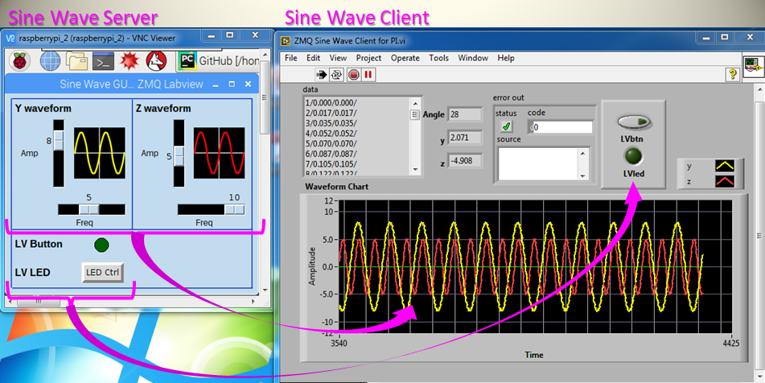

# Raspberry Pi and Windows PC Data Communication
## Overview
The purpose of this project was to explore the use of ZMQ as a cross platform data transfer tool. The project is divided into two parts. The first part establishes the basic methodology to create an Internet communication channel between a Raspberry Pi with a LINUX operating system and a desktop PC running Windows. A modified version of the Python "Hello World" program from the ZMQ documentation is adapted and used to work out the bugs. Notes on getting things to work can be found [here](DOC/ZeroMQ_Pi-PC_Client-Server_Python.pdf).
## Sine Wave GUI
Building on the basics, a data transfer scheme was built and tested. For this application roles are reversed for the Pi and PC with the Pi serving waveform data to client PC running LabVIEW. Additionally bidirectional boolean data is exchanged to control LED indicators on both ends. All of the data is packaged as a string using simple delimiters that can be used to decipher the data on the receiving end. As with the basic testing, port forwarding is required to be opened on the router for the Pi server. The Pi GUI is based on Tkinter and also requires the PIL image processing library. The labVIEW client on the PC is based on a [ZMQ VI library](http://labview-zmq.sourceforge.net) that has all of the same functionality as the Python library on the Pi. The following screen shots show the controls and indicator layout and the demo shows it all in action.  
  
*Pi/Python and LabVIEW/PC GUI Screen shots*  
 
